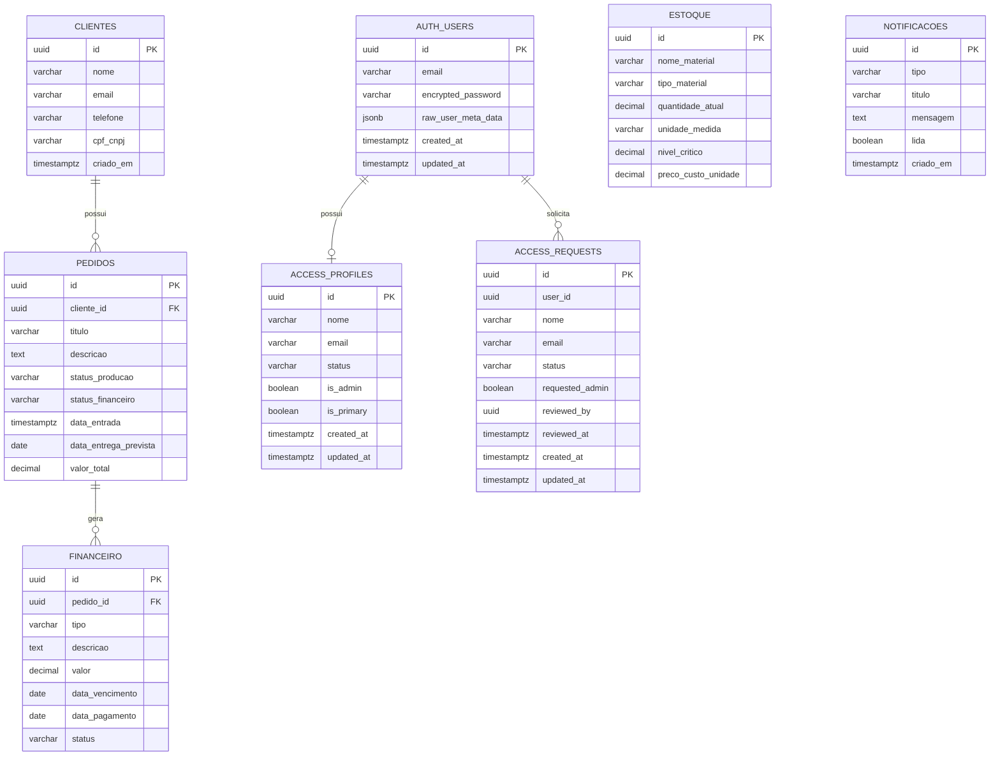

# 3. Especificações do Projeto

📌 **Pré-requisito:** Planejamento do Projeto (Cronograma e Sprints definidos).

Nesta seção serão detalhados:

- ✅ Requisitos Funcionais
- ✅ Histórias de Usuário
- ✅ Requisitos Não Funcionais
- ✅ Restrições do Projeto
- ✅ Engenharia Reversa do Banco de Dados
- ✅ Back-end implementado

O objetivo é organizar claramente as funcionalidades, qualidades e limites da solução.

---

# 3.1 Requisitos Funcionais

Os **Requisitos Funcionais (RF)** descrevem o que o sistema deve fazer.

---

## Tabela de Requisitos Funcionais

| ID | Descrição do Requisito | Prioridade |
|----|-------------------------|------------|
| RF-01 | O sistema deve permitir que o usuário faça login informando e-mail e senha. | 🔴 ALTA |
| RF-02 | O sistema deve permitir que novos usuários criem/solicitem acesso informando nome, e-mail e senha. | 🔴 ALTA |
| RF-03 | O sistema deve permitir recuperação de senha por e-mail. | 🔴 ALTA |
| RF-04 | O sistema deve permitir que o usuário cadastre uma nova senha após acessar o link de recuperação. | 🔴 ALTA |
| RF-05 | O sistema deve validar a sessão do usuário antes de permitir acesso às telas internas. | 🔴 ALTA |
| RF-06 | O sistema deve permitir logout do usuário autenticado. | 🔴 ALTA |
| RF-07 | O sistema deve permitir que administradores aprovem, recusem, revoguem e alterem perfis de acesso. | 🔴 ALTA |
| RF-08 | O sistema deve exibir um dashboard administrativo após o login, com indicadores de pedidos, receita, produção e estoque. | 🟡 MÉDIA |
| RF-09 | O sistema deve permitir que funcionários cadastrem clientes informando nome, e-mail, telefone e CPF/CNPJ. | 🔴 ALTA |
| RF-10 | O sistema deve exibir e buscar os clientes cadastrados na aba de clientes. | 🔴 ALTA |
| RF-11 | O sistema deve permitir editar os dados de clientes cadastrados. | 🔴 ALTA |
| RF-12 | O sistema deve permitir remover clientes cadastrados, respeitando vínculos com pedidos. | 🔴 ALTA |
| RF-13 | O sistema deve atualizar a lista de clientes quando houver alterações no banco. | 🟡 MÉDIA |
| RF-14 | O sistema deve permitir cadastrar novos pedidos vinculando a um cliente. | 🔴 ALTA |
| RF-15 | O sistema deve exibir, buscar e filtrar os pedidos cadastrados. | 🔴 ALTA |
| RF-16 | O sistema deve permitir editar, atualizar status e remover pedidos. | 🔴 ALTA |
| RF-17 | O sistema deve permitir cadastrar, listar, buscar, editar e remover materiais do estoque. | 🔴 ALTA |
| RF-18 | O sistema deve exibir alertas e indicadores relacionados ao nível crítico de estoque. | 🟡 MÉDIA |
| RF-19 | O sistema deve permitir cadastrar, listar, editar e remover transações financeiras. | 🔴 ALTA |
| RF-20 | O sistema deve exibir totais financeiros de entradas, saídas e saldo. | 🟡 MÉDIA |
| RF-21 | O sistema deve exibir notificações e permitir marcá-las como lidas ou removê-las. | 🟡 MÉDIA |
| RF-22 | O sistema deve permitir alternar entre modo claro e modo escuro. | 🟢 BAIXA |
| RF-23 | O sistema deve exibir mensagens de sucesso, erro e confirmação nas principais operações. | 🟡 MÉDIA |

---

# 3.2 Histórias de Usuário

Cada história segue o padrão:

> **Como** [persona],  
> **eu quero** [funcionalidade],  
> **para que** [benefício].

Cada História de Usuário está associada a um Requisito Funcional específico.

---

## Histórias do Projeto

### História 1 (relacionada ao RF-01 e RF-05)

Como funcionário da gráfica  
Eu quero acessar o sistema com e-mail e senha  
Para que eu consiga visualizar o dashboard e utilizar as funcionalidades internas.

---

### História 2 (relacionada ao RF-02)

Como novo usuário do sistema  
Eu quero solicitar/criar meu acesso informando nome, e-mail e senha  
Para que eu possa utilizar o sistema da gráfica.

---

### História 3 (relacionada ao RF-03 e RF-04)

Como usuário cadastrado  
Eu quero recuperar minha senha por e-mail  
Para que eu consiga acessar novamente o sistema caso esqueça minha senha.

---

### História 4 (relacionada ao RF-06)

Como usuário autenticado  
Eu quero sair do sistema  
Para que minha sessão seja encerrada com segurança.

---

### História 5 (relacionada ao RF-08)

Como funcionário da gráfica  
Eu quero visualizar um dashboard administrativo  
Para que eu acompanhe informações gerais da operação.

---

### História 6 (relacionada ao RF-09 e RF-10)

Como atendente da gráfica  
Eu quero cadastrar clientes com nome, e-mail, telefone e CPF/CNPJ  
Para manter os dados organizados e utilizá-los no atendimento.

---

### História 7 (relacionada ao RF-11)

Como atendente da gráfica  
Eu quero editar os dados de um cliente cadastrado  
Para corrigir ou atualizar informações.

---

### História 8 (relacionada ao RF-12)

Como atendente da gráfica  
Eu quero remover clientes cadastrados  
Para excluir registros incorretos ou desnecessários.

---

### História 9 (relacionada ao RF-22)

Como usuário do sistema  
Eu quero alternar entre modo claro e escuro  
Para usar a interface com melhor conforto visual.

---

### História 10 (relacionada aos RF-14, RF-15 e RF-16)

Como funcionário da gráfica  
Eu quero visualizar, cadastrar e gerenciar os pedidos
Para que eu possa acompanhar a produção, valores e prazos de entrega.

---

### História 11 (relacionada aos RF-17 e RF-18)

Como funcionário da gráfica  
Eu quero cadastrar e acompanhar materiais do estoque  
Para que eu consiga identificar materiais disponíveis e itens em nível crítico.

---

### História 12 (relacionada aos RF-19 e RF-20)

Como funcionário da gráfica  
Eu quero registrar entradas e saídas financeiras  
Para que eu consiga acompanhar o saldo e a movimentação financeira da gráfica.

---

### História 13 (relacionada ao RF-21)

Como usuário do sistema  
Eu quero visualizar e gerenciar notificações  
Para que eu acompanhe avisos importantes sobre pedidos, estoque e acessos.

---

### História 14 (relacionada ao RF-07)

Como administrador  
Eu quero aprovar, recusar ou alterar permissões de usuários  
Para controlar quem pode acessar o sistema e quais usuários possuem perfil administrativo.

---

# 3.3 Requisitos Não Funcionais

Os **Requisitos Não Funcionais (RNF)** definem características de qualidade do sistema.

---

## Tabela de Requisitos Não Funcionais

| ID | Descrição do Requisito | Prioridade |
|----|-------------------------|------------|
| RNF-01 | O sistema deve utilizar autenticação segura por meio do Supabase Auth. | 🔴 ALTA |
| RNF-02 | O sistema deve proteger as rotas internas, permitindo acesso apenas a usuários autenticados e aprovados. | 🔴 ALTA |
| RNF-03 | O sistema deve validar campos obrigatórios antes de enviar cadastros ao banco de dados. | 🔴 ALTA |
| RNF-04 | O sistema deve apresentar mensagens claras de erro ou sucesso ao usuário. | 🟡 MÉDIA |
| RNF-05 | O sistema deve ser responsivo para uso em diferentes tamanhos de tela. | 🟡 MÉDIA |
| RNF-06 | O sistema deve armazenar a preferência de tema claro/escuro no navegador do usuário. | 🟢 BAIXA |
| RNF-07 | O sistema deve utilizar variáveis de ambiente para conexão com o Supabase. | 🔴 ALTA |
| RNF-08 | O sistema deve compilar sem erros usando Next.js com Webpack. | 🔴 ALTA |
| RNF-09 | O sistema deve manter identidade visual compatível com a Gráfica Simapel. | 🟡 MÉDIA |
| RNF-10 | O sistema deve sincronizar dados com o banco em tempo real quando possível. | 🟡 MÉDIA |
| RNF-11 | O sistema deve utilizar componentes e navegação consistentes entre os módulos internos. | 🟡 MÉDIA |
| RNF-12 | O sistema deve tratar falhas de banco e autenticação com mensagens compreensíveis ao usuário. | 🟡 MÉDIA |
| RNF-13 | O sistema deve executar localmente com Node.js e npm no ambiente de desenvolvimento. | 🔴 ALTA |

---

# 3.4 Restrições do Projeto

📌 **Restrições** são limitações externas impostas ao projeto.

---

## Tabela de Restrições

| ID | Restrição |
|----|-----------|
| R-01 | O projeto deverá ser entregue dentro do prazo definido para a sprint/semestre. |
| R-02 | O sistema deve ser desenvolvido utilizando Next.js, React e JavaScript/TypeScript. |
| R-03 | O banco de dados e a autenticação devem utilizar Supabase. |
| R-04 | O projeto deve ser versionado e entregue pelo GitHub. |
| R-05 | As chaves públicas de conexão com o Supabase devem ficar em variáveis de ambiente. |
| R-06 | O sistema deve ser executado localmente durante o desenvolvimento com Node.js e npm. |
| R-07 | O projeto deve usar Webpack no ambiente atual para evitar falhas do Turbopack causadas pela política de segurança do Windows. |
| R-08 | O escopo atual contempla autenticação, dashboard, clientes, pedidos, estoque, financeiro, notificações e controle de acesso; integrações externas e relatórios avançados ficam fora da versão entregue. |

---

# 3.5 Engenharia Reversa - Modelo Físico de Dados

A engenharia reversa foi feita a partir do código implementado na aplicação.

O sistema utiliza Supabase para autenticação e persistência dos dados. A partir do código, foram identificadas as seguintes estruturas:

| Tabela | Finalidade | Campos identificados |
|--------|------------|----------------------|
| `auth.users` | Controle de usuários autenticados pelo Supabase Auth. | `id`, `email`, `encrypted_password`, `raw_user_meta_data`, `created_at`, `updated_at` |
| `clientes` | Armazenamento dos clientes cadastrados pela gráfica. | `id`, `nome`, `email`, `telefone`, `cpf_cnpj`, `criado_em` |
| `pedidos` | Armazenamento dos pedidos vinculados a clientes. | `id`, `cliente_id`, `titulo`, `descricao`, `status_producao`, `status_financeiro`, `data_entrada`, `data_entrega_prevista`, `valor_total` |
| `estoque` | Controle dos materiais disponíveis na gráfica. | `id`, `nome_material`, `tipo_material`, `quantidade_atual`, `unidade_medida`, `nivel_critico`, `preco_custo_unidade` |
| `financeiro` | Registro de entradas e saídas financeiras. | `id`, `pedido_id`, `tipo`, `descricao`, `valor`, `data_vencimento`, `data_pagamento`, `status` |
| `notificacoes` | Central de notificações exibida no sistema. | `id`, `tipo`, `titulo`, `mensagem`, `lida`, `criado_em` |
| `access_profiles` | Controle de perfis aprovados e permissões administrativas. | `id`, `nome`, `email`, `status`, `is_admin`, `is_primary`, `created_at`, `updated_at` |
| `access_requests` | Registro de solicitações de acesso pendentes de análise. | `id`, `user_id`, `nome`, `email`, `status`, `requested_admin`, `reviewed_by`, `reviewed_at`, `created_at`, `updated_at` |

## Representação do Modelo Físico de Dados

Observação: o relacionamento entre `auth.users` e as tabelas de controle de acesso é utilizado para validar usuários aprovados e administradores. A tabela `clientes` se relaciona com `pedidos` por meio do campo `cliente_id`.

---

# 3.6 Back-end Implementado

As principais funcionalidades de back-end foram implementadas por meio do Supabase, utilizando o SDK `@supabase/supabase-js`.

| Funcionalidade | Implementação |
|----------------|---------------|
| Login | `supabase.auth.signInWithPassword` |
| Cadastro de usuário | `supabase.auth.signUp` |
| Logout | `supabase.auth.signOut` |
| Recuperação de senha | `supabase.auth.resetPasswordForEmail` |
| Validação do link de recuperação | `supabase.auth.exchangeCodeForSession` |
| Atualização de senha | `supabase.auth.updateUser` |
| Validação de sessão | `supabase.auth.getSession` |
| Controle de acesso aprovado | Consultas em `access_profiles` e `access_requests` |
| Cadastro de clientes | `supabase.from('clientes').insert` |
| Listagem de clientes | `supabase.from('clientes').select` |
| Edição de clientes | `supabase.from('clientes').update` |
| Remoção de clientes | `supabase.from('clientes').delete` |
| Cadastro de pedidos | `supabase.from('pedidos').insert` |
| Listagem de pedidos | `supabase.from('pedidos').select('*, clientes(nome)')` |
| Edição de pedidos | `supabase.from('pedidos').update` |
| Remoção de pedidos | `supabase.from('pedidos').delete` |
| Cadastro de estoque | `supabase.from('estoque').insert` |
| Listagem de estoque | `supabase.from('estoque').select` |
| Edição de estoque | `supabase.from('estoque').update` |
| Remoção de estoque | `supabase.from('estoque').delete` |
| Cadastro financeiro | `supabase.from('financeiro').insert` |
| Listagem financeira | `supabase.from('financeiro').select` |
| Edição financeira | `supabase.from('financeiro').update` |
| Remoção financeira | `supabase.from('financeiro').delete` |
| Notificações | `supabase.from('notificacoes').select`, `update` e `delete` |
| Atualização em tempo real | Canais `postgres_changes` do Supabase |

---

# ✅ Checklist de Validação

Antes de entregar, confirme:

- [x] Todos os RFs estão claros e numerados corretamente.
- [x] Todas as Histórias estão associadas a um RF.
- [x] RNFs estão descritos e relacionados à qualidade da solução.
- [x] Restrições são limitações externas ou técnicas do projeto.
- [x] O modelo físico de dados foi descrito a partir do código.
- [x] As principais funcionalidades de back-end foram documentadas.
- [x] O documento está atualizado no GitHub.
