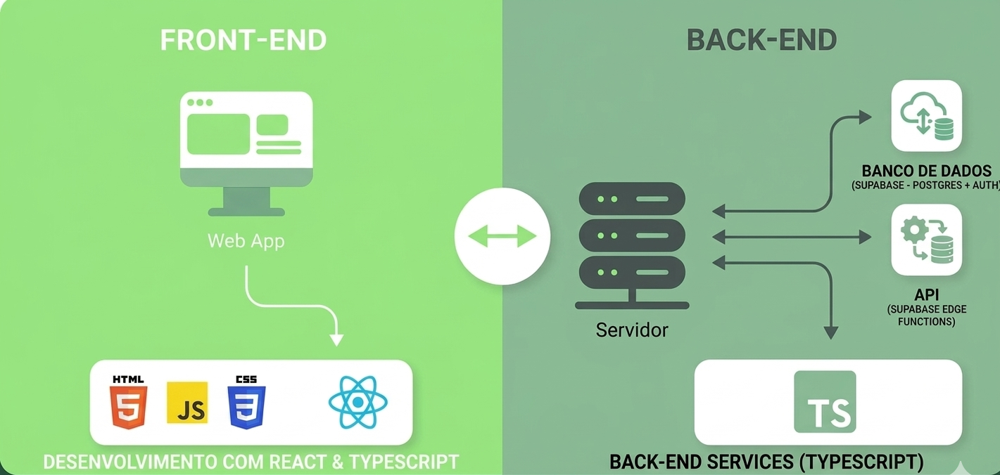
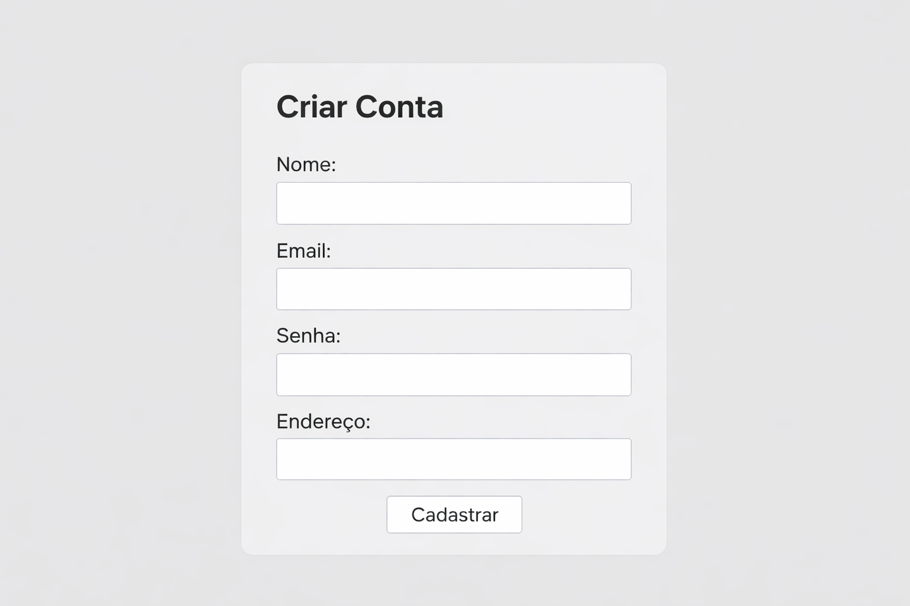
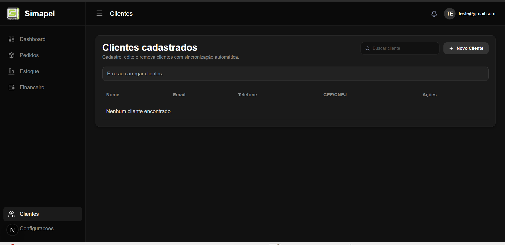
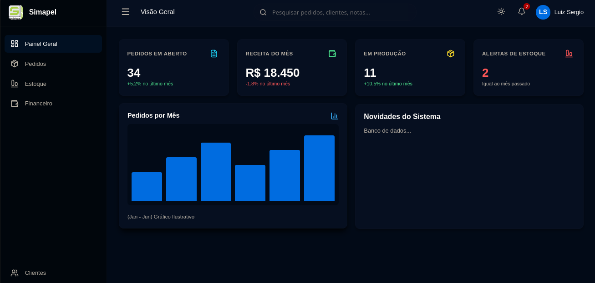
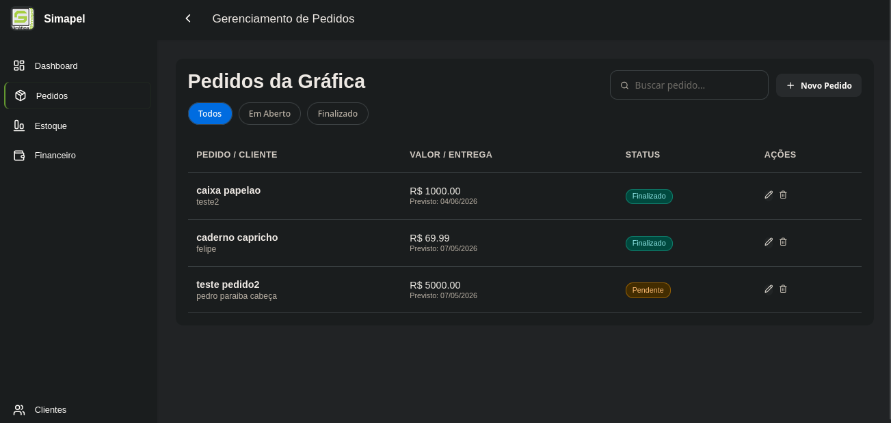

# 4. Projeto da Solução

> ⚠️ **Aviso aos Squads (Software House)**
>
> Esta seção **não deve ser preenchida integralmente antes da codificação**.
> Trata-se de um **Documento Vivo**, que deverá ser atualizado **incrementalmente a cada Sprint**, refletindo fielmente o código real implementado.

---

## 4.1 Arquitetura da Solução (Sprint 1 e 2)

Apresente um **diagrama macro** demonstrando como os componentes do sistema se comunicam.

A arquitetura deve refletir o modelo de **fatias verticais**, evidenciando o fluxo:

**Front-end → API (Back-end) → Banco de Dados**

Semelhante à imagem abaixo:


 **Fonte:** [Guia Completo de Desenvolvimento de Software - UDS](https://uds.com.br/blog/desenvolvimento-de-software-guia-completo/) <br><br>
 
 ### 📎 Inserir o Diagrama de Arquitetura do Projeto do Grupo
  


---
🔧**Ferramentas recomendadas:**
- Draw.io
- Lucidchart
- Figma

---

## 4.2 Tecnologias Utilizadas (Sprint 1)

Descreva as tecnologias, linguagens, frameworks, bibliotecas e serviços escolhidos pelo Squad.

| Dimensão | Tecnologia Escolhida |
|----------|----------------------|
| Banco de Dados (SGBD) | Ex: SQL Server, PostgreSQL ou MongoDB |
| Back-end (API) | Ex: C# (.NET Core) |
| Front-end / Mobile | Ex: HTML + CSS + JavaScript, React ou Flutter |
| Hospedagem / Deploy | Ex: Azure, AWS, Render ou Railway |
| Gestão e Versionamento | GitHub e GitHub Projects (Kanban) |

 ⚠️ **Observação:**
 - GitHub Pages não executa back-end.
 - Utilize apenas tecnologias realmente implementadas.

---

##  4.3 Wireframes ou Mockups (A partir da Sprint 2)

Apresente os protótipos das telas (Wireframes/Mockups) apenas das funcionalidades que estão sendo implementadas na Sprint atual.

Cada Wireframe ou Mockups devem estar associados a pelo menos:

- Um Requisito Funcional (RF-XX)
- Uma História de Usuário


## 📌 Exemplo Ilustrativo – Tela de Cadastro (RF-01)

**História associada:** Como usuário, quero criar uma conta para acessar o sistema.

Representação simplificada do Wireframe:



**Descrição:** A interface contempla todos os campos exigidos pelo RF-01 e permite persistência no banco após validação no backend.

---
🔧 **Ferramentas sugeridas:**
- Figma  
- MarvelApp  
- Balsamiq  
---

### 📎 Inserir AQUI Wireframes/ Mockups do Projeto de Software

🚨 O grupo deverá inserir aqui a imagem

**Wireframe: Tela de Gestão de Clientes**


* **Requisitos Funcionais Associados:** RF-08 (Cadastrar clientes), RF-09 (Exibir lista de clientes), RF-10 (Editar clientes) e RF-11 (Remover clientes).
* **Histórias de Usuário Associadas:** 
  * História 6 (Como atendente, quero cadastrar clientes.)
  * História 7 (Como atendente, quero editar os dados)
  * História 8 (Como atendente, quero remover clientes.)

 **Wireframe: Tela do Dashboard (Painel Geral)**


* **Requisito Funcional Associado:** RF-07 (Exibir um dashboard administrativo após o login).
* **História de Usuário Associada:** História 5 (Como funcionário, quero visualizar um dashboard administrativo para acompanhar informações gerais).

**Wireframe: Tela de Gerenciamento de Pedidos**


* **Requisitos Funcionais Associados:** RF-15 (Listar pedidos), RF-16 (Cadastrar novo pedido) e RF-17 (Atualizar status e remover pedido). 
* **História de Usuário Associada:** História 10 (Como funcionário da gráfica, quero visualizar, cadastrar e gerenciar os pedidos para acompanhar a produção e os prazos).

## 4.4 Modelagem de Dados (Sprint 2 e 3)

O sistema exige persistência de dados.

A documentação do banco seguirá a abordagem de **entrega contínua**, sendo expandida conforme evolução do projeto.

---

### 4.4.1 Script Físico (Entrega na Sprint 2 - MVP)

Para a primeira fatia vertical (MVP), o Squad deverá entregar o **script de criação das tabelas ou coleções utilizadas**.

#### 🔹 Para Banco Relacional (SQL)

Incluir:

- Comandos `CREATE TABLE`
- Definição de chave primária (PK)
- Definição de chaves estrangeiras (FK)

**Exemplo:**

```sql
CREATE TABLE Usuario (
    Id INT PRIMARY KEY,
    Nome VARCHAR(100),
    Email VARCHAR(150) UNIQUE,
    Senha VARCHAR(200)
);
```

---

### Para Banco NoSQL

Incluir a estrutura dos documentos JSON (Schema).

**Exemplo:**

```json
{
  "nome": "João Silva",
  "email": "joao@email.com",
  "senha": "hash_da_senha"
}
```

### 📁 Obrigatório

O arquivo .sql ou .js deve ser salvo na pasta: src/bd

```
CREATE TABLE clientes (
    id          UUID PRIMARY KEY DEFAULT gen_random_uuid(),
    nome        TEXT NOT NULL,
    email       TEXT UNIQUE,
    telefone    TEXT,
    cpf_cnpj    TEXT,
    criado_em   TIMESTAMP WITH TIME ZONE DEFAULT timezone('utc'::text, now())
);


CREATE TABLE estoque (
    id                  UUID PRIMARY KEY DEFAULT gen_random_uuid(),
    nome_material       TEXT NOT NULL,
    tipo_material       TEXT, -- Ex: Papel, Tinta, Lona
    quantidade_atual    DECIMAL DEFAULT 0,
    unidade_medida      TEXT, -- Ex: Folha, ML, Metro
    nivel_critico       DECIMAL DEFAULT 10,
    preco_custo_unidade DECIMAL(10,2)
);


CREATE TABLE pedidos (
    id                    UUID PRIMARY KEY DEFAULT gen_random_uuid(),
    cliente_id            UUID REFERENCES clientes(id),
    status_producao       TEXT DEFAULT 'orcamento', -- orcamento, criacao, producao, acabamento, finalizado
    status_financeiro     TEXT DEFAULT 'pendente',  -- pendente, pago, parcial
    data_entrada          TIMESTAMP WITH TIME ZONE DEFAULT now(),
    data_entrega_prevista DATE,
    valor_total           DECIMAL(10,2) DEFAULT 0,
    margem_lucro          DECIMAL(10,2),
    titulo                TEXT,
    descricao             TEXT 
);
CREATE TABLE itens_pedido (
    id                   UUID PRIMARY KEY DEFAULT gen_random_uuid(),
    pedido_id            UUID REFERENCES pedidos(id) ON DELETE CASCADE,
    material_id          UUID REFERENCES estoque(id),
    quantidade_pedida    INTEGER, -- Ex: 250 unidades
    aproveitamento_folha INTEGER, -- Ex: 9 (o F9)
    -- Cálculo automático de folhas: (Quantidade / Aproveitamento) arredondado para cima.
    folhas_utilizadas    DECIMAL GENERATED ALWAYS AS (CEIL(quantidade_pedida::float / aproveitamento_folha::float)) STORED
);

CREATE TABLE financeiro (
    id              UUID PRIMARY KEY DEFAULT gen_random_uuid(),
    pedido_id       UUID REFERENCES pedidos(id) ON DELETE SET NULL,
    tipo            TEXT CHECK (tipo IN ('entrada', 'saida')),
    descricao       TEXT,
    valor           DECIMAL(10,2),
    data_vencimento DATE,
    data_pagamento  DATE,
    status          TEXT DEFAULT 'pendente'
);
```
 


 
---
### 4.4.2 Representação do Modelo Físico de Dados (Entrega na Sprint 3 - Core)


> **Fundamentação:** Os modelos de dados físicos fornecem detalhes minuciosos que auxiliam administradores e desenvolvedores na implementação da lógica de negócios em um banco de dados real.
> Eles incluem elementos não especificados no modelo lógico, como:
> - Tipos de dados específicos da plataforma
> - Restrições
> - Índices
> - Triggers (quando aplicável)
> - Procedimentos armazenados (quando aplicável)
>
>Por representarem um banco real, devem respeitar:
> - Convenções de nomenclatura
> - Restrições da plataforma
> - Uso adequado de palavras reservadas <br>


**Exemplo:**


**FONTE:** <https://aws.amazon.com/pt/compare/the-difference-between-logical-and-physical-data-model/>

<br>O grupo deverá gerar um diagrama físico do banco de dados (estrutura real das tabelas), evidenciando PKs, FKs e relacionamentos, conforme implementado no código.

Este modelo deve exibir:
- Tabelas ou coleções existentes
- Atributos com seus respectivos tipos de dados
- Chaves Primárias (PK)
- Chaves Estrangeiras (FK)
- Relacionamentos entre tabelas
- Restrições implementadas (quando aplicável)

---

### 📌 Requisitos Obrigatórios

- O diagrama deve representar fielmente o banco já implementado.
- Deve refletir exatamente o que foi criado nas Sprints 2 e 3.
- Não incluir tabelas que não existam no código.
- Deve contemplar o controle de acesso de usuários, quando implementado.
- Deve respeitar as convenções e restrições da plataforma utilizada.

---

### 📎 Representação do Modelo Físico de Dados
🚨 O grupo deverá inserir aqui a imagem do diagrama físico de dados.

---
🔧**Ferramentas Sugeridas**
- MySQL Workbench (engenharia reversa automática)
- DbDesigner
- Lucidchart
