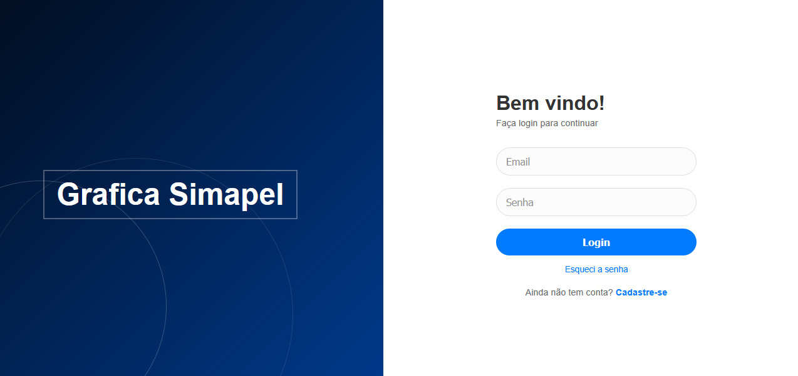
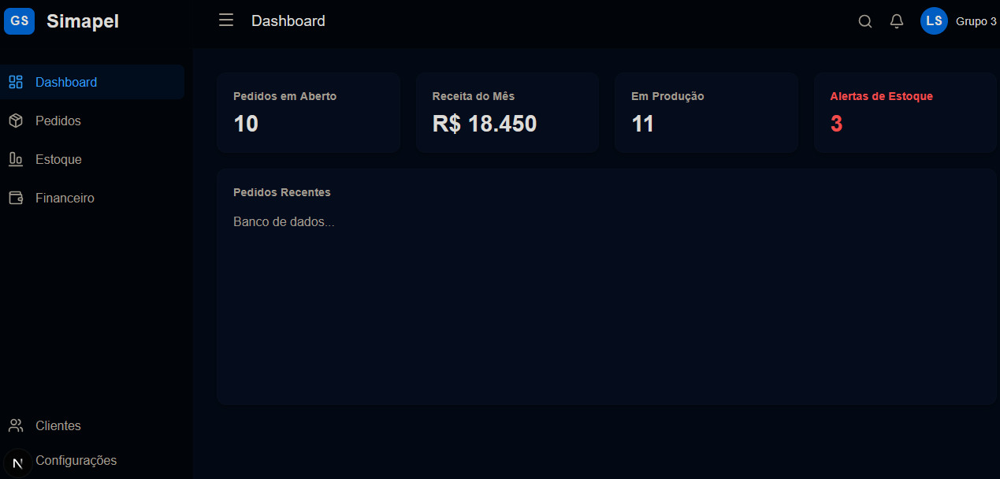
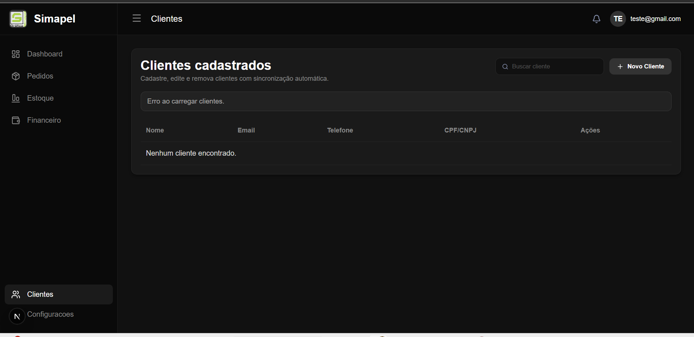
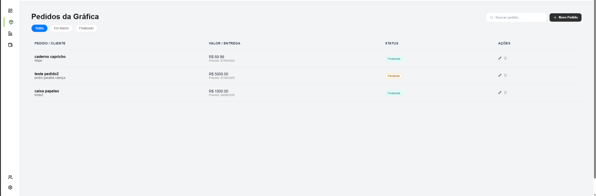
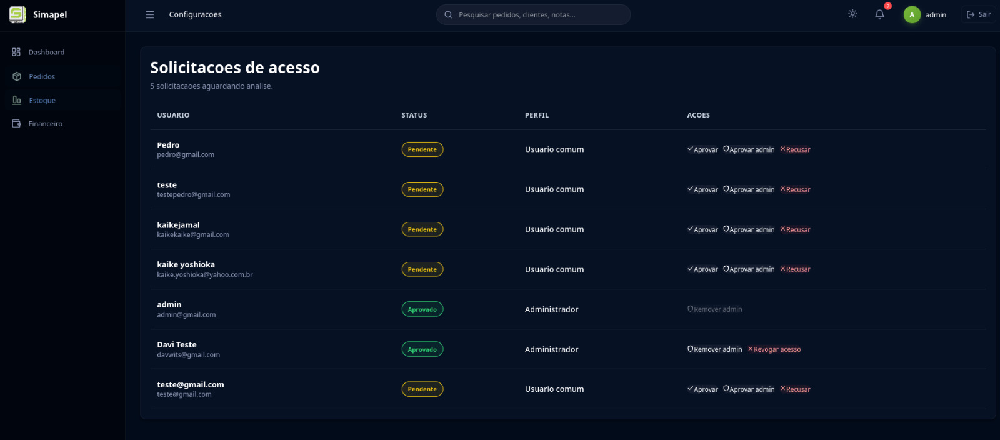
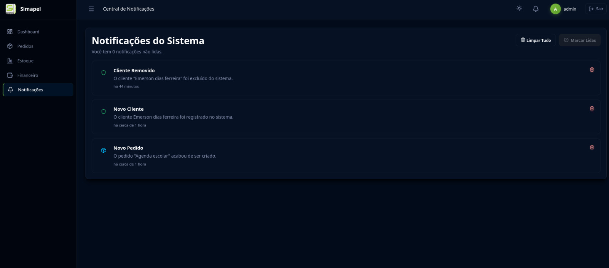
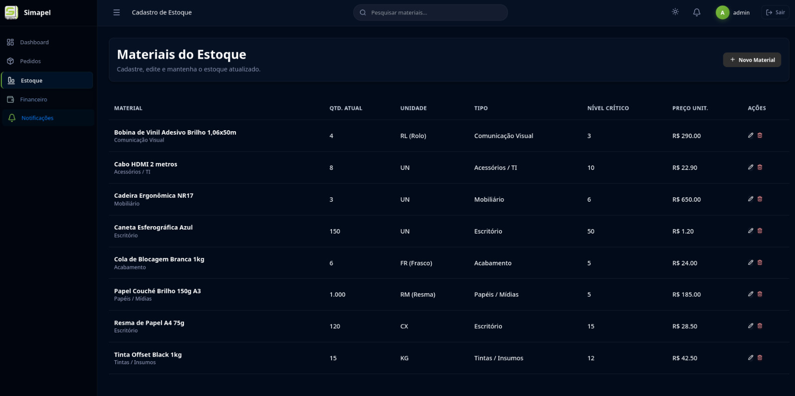
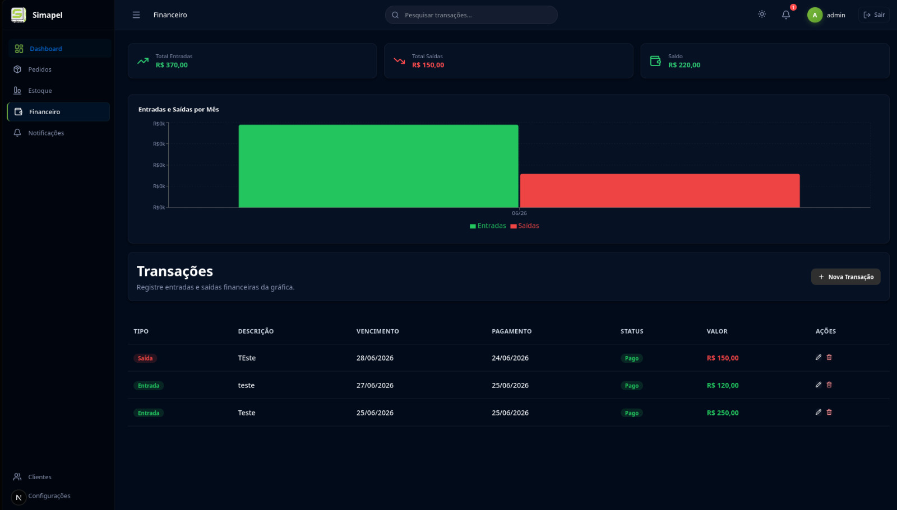

# 5. Interface do Sistema

> ⚠️ **Aviso aos Squads:**
> Diferente da Seção 4 (onde vocês colocaram os wireframes/Mockups), esta seção é o **Portfólio Visual** do software real. Aqui devem constar apenas as capturas de tela (screenshots) do **sistema já codificado e funcionando**.

Esta seção deve ser atualizada a cada Sprint, servindo como um registro histórico da evolução da interface da aplicação web.   

## 5.1. Galeria de Telas (Por Sprint)

Apresente as imagens reais das telas implementadas, associando-as à funcionalidade (Fatia Vertical) entregue na Sprint correspondente. Descreva brevemente o que cada tela faz.  

**🟢 Sprint 1: Hello World / Tela Inicial**
* **Funcionalidade:** Ponto de entrada do sistema e navegação principal / Login
* **Descrição:** Tela inicial de Login conectada à API.

   
> 💡 **Importante:** Uma mesma funcionalidade (fatia) pode render **várias telas** (ex: tela de listagem, formulário de cadastro e modal de sucesso). **Coloque prints de todas as etapas do fluxo.**   

**🟡 Sprint 2: MVP (Primeira Fatia Vertical)**
* **Funcionalidade:** Criação do Dashboard principal e aba de cadastro de clientes
* **Descrição:** Um dashboard estático para armazenar posteriores informações dos dados de pedidos e clientes, além da criação funcional da tela de cadastro de clientes.
*    
*   
> 💡 **Importante:** Uma mesma funcionalidade (fatia) pode render **várias telas** (ex: tela de listagem, formulário de cadastro e modal de sucesso). **Coloque prints de todas as etapas do fluxo.**   

**🔵 Sprint 3: Core (Regras de Negócio)**
* **Funcionalidade:** Cadastro de Pedidos
* **Descrição:** Interface que permite o cadastro de pedidos de acordo com respectivo cliente.
*   
> 💡 **Importante:** Uma mesma funcionalidade (fatia) pode render **várias telas** (ex: tela de listagem, formulário de cadastro e modal de sucesso). **Coloque prints de todas as etapas do fluxo.**   

**🔴 Sprint 4: Entrega Final**
* **Funcionalidade:** Polimento visual e telas secundárias.
* **Descrição:** Telas finais de configurações, notificações, estoque e financeiro.
*   
*   
*   
*   
> 💡 **Importante:** Uma mesma funcionalidade (fatia) pode render **várias telas** (ex: tela de listagem, formulário de cadastro e modal de sucesso). **Coloque prints de todas as etapas do fluxo.**   

> 📸 **Dica:** Certifiquem-se de que as imagens tenham boa resolução e mostrem o sistema rodando no navegador. Salvem todas as imagens na pasta `images/` do repositório.

